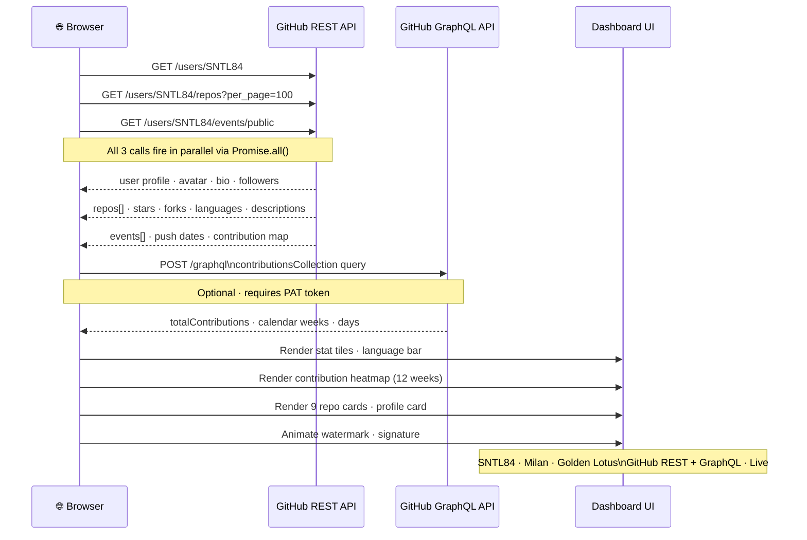

<!-- AUTO-GENERATED STATS UPDATE EVERY 4 HOURS - OPTIMIZED FOR GITHUB BADGES -->

<div align="center">

# 🔢 SNTL84 · Live Repository Counter

[](https://github.com/SNTL84/sntl84-repo-counter/actions)
[](https://github.com/SNTL84/sntl84-repo-counter/actions)
[](https://www.python.org)
[](LICENSE)
[](https://github.com/SNTL84)
[](https://desidevloper.com)
[](https://sntl84.github.io/sntl84-repo-counter/sntl84-Client-Dashboard.html)

---

### ⚡ *"I Automate What's Costing You Money."*
**Milan · SNTL 84 · AI Workflow Developer · Surat, India**

</div>

---

## 📊 Live Repository Statistics

<!-- REPO_COUNT_START -->
| Metric | Count | Details |
|--------|-------|---------|
| 🌐 Public Repos  | **59** | All public repositories |
| 🔒 Private Repos | **0** | Requires `GH_PAT` secret (repo scope) for accuracy |
| 📦 Total Repos   | **59** | Public + Private |
| ⭐ Total Stars   | **55** | Across all public repos |
| 🍴 Total Forks   | **0** | Across all public repos |
| 🏆 Top Language  | **HTML** | 20 repos |
<!-- REPO_COUNT_END -->

<!-- TIMESTAMP_START -->
> 🕐 *Last updated: **10 Jul 2026 · 17:49 UTC** · Auto-refreshes every 4 hours via GitHub Actions*
<!-- TIMESTAMP_END -->

---

## 🚀 Quick Start

### For Users

1. **View Live Stats**: Check the [statistics table](#-live-repository-statistics) above
2. **Live Dashboard**: Open the [GitHub Intelligence Dashboard](https://sntl84.github.io/sntl84-repo-counter/sntl84-Client-Dashboard.html) — powered by live GitHub REST + GraphQL API
3. **Hire SNTL84**: [Message on WhatsApp](https://wa.me/919727413309) for AI automation services

### For Contributors

1. **Fork this repo**: Create your copy
2. **Clone locally**: `git clone https://github.com/YOUR-USERNAME/sntl84-repo-counter.git`
3. **Set up Python**: `python -m venv venv && source venv/bin/activate`
4. **Install deps**: `pip install -r requirements.txt`
5. **Test locally**: `export GH_TOKEN=your_token && python scripts/count_repos.py`
6. **Submit PR**: Create a pull request with your changes

See [CONTRIBUTING.md](CONTRIBUTING.md) for detailed guidelines.

---

## 🔑 Fix Private Repo Count

> **Private repos showing 0?** The default `GITHUB_TOKEN` can't read private repo counts.
> Add a **Personal Access Token** as a secret to enable accurate private counting.

| Step | Action |
|------|--------|
| 1️⃣ | Go to **GitHub → Settings → Developer Settings → Personal Access Tokens → Classic** |
| 2️⃣ | Generate a new token with **`repo`** scope |
| 3️⃣ | Go to **this repo → Settings → Secrets and Variables → Actions** |
| 4️⃣ | Create secret named **`GH_PAT`** with your token value |
| 5️⃣ | Re-run the workflow — private count will be accurate ✅ |

---

## 🏗️ Technical Architecture

```mermaid
flowchart TD
    A([⏰ Scheduled Trigger\nEvery 4 hours]) --> B
    A2([🔀 Push to main]) --> B
    A3([▶️ Manual Dispatch]) --> B

    B[GitHub Actions Runner\nubuntu-latest] --> C

    C[scripts/count_repos.py] --> D
    C --> E

    D["🔷 GraphQL API\napi.github.com/graphql\nviewer.repositories\n(public + private counts)"] --> F
    E["🟢 REST API\napi.github.com/users/SNTL84/repos\n(paginated · per_page=100)"] --> F

    F[Parse & Aggregate\nstats · languages · stars · forks] --> G

    G[Patch README.md\nbetween marker comments] --> G1
    G1["`REPO_COUNT_START/END`\nStats table"] --> H
    G --> G2["`REPO_LIST_START/END`\nFull repo list"]
    G2 --> H
    G --> G3["`TIMESTAMP_START/END`\nLast updated time"]
    G3 --> H

    H[git commit & push\nSNTL84-Bot · skip ci] --> I

    I([✅ README live\nwith fresh stats])

    style A fill:#1a2a1a,stroke:#22e0b8,color:#22e0b8
    style A2 fill:#1a2a1a,stroke:#22e0b8,color:#22e0b8
    style A3 fill:#1a2a1a,stroke:#22e0b8,color:#22e0b8
    style D fill:#0d1f3c,stroke:#3178c6,color:#7ab8f5
    style E fill:#0d1f3c,stroke:#3572A5,color:#7ab8f5
    style I fill:#1a2a1a,stroke:#22e0b8,color:#22e0b8
```

---

## 🔄 Live GitHub API Flow (Dashboard)

> The [live dashboard](https://sntl84.github.io/sntl84-repo-counter/sntl84-Client-Dashboard.html) calls GitHub REST & GraphQL APIs **directly from the browser** on every page load — no backend, no cache, no proxy.



---

## ⚙️ How It Works

1. **Scheduled Trigger**: GitHub Actions runs every 4 hours
2. **API Calls**: Script fetches repo counts via GraphQL & REST APIs
3. **Data Processing**: Aggregates stats, languages, stars, forks
4. **README Update**: Patches README.md between marker comments
5. **Auto-Commit**: Git commits and pushes changes automatically
6. **Monitoring**: Status badges show workflow health

| Setting | Value |
|---------|-------|
| 🔁 Schedule | Every 4 hours (optimized) |
| 🔐 Auth | GITHUB_TOKEN (public) + GH_PAT (private) |
| 🤖 Bot | SNTL84-Bot |
| 📝 Commit | `chore: auto-update repo count [skip ci]` |
| ⚡ Retry Logic | 3 attempts with exponential backoff |
| 📊 Performance | Metrics tracking & rate limit awareness |

---

## 🚀 Work With SNTL 84

**Built for founders who move fast and waste nothing.**
- ✅ AI automation & workflow orchestration
- ✅ Full-stack web development
- ✅ Zero-bloat, high-impact solutions
- ✅ 24/7 WhatsApp support

<div align="center">

| 🌐 Website | 💬 WhatsApp | 🔗 LinkedIn | 💻 GitHub |
|-----------|-------------|-------------|----------|
| [desidevloper.com](https://desidevloper.com) | [Message Now](https://wa.me/919727413309) | [Connect](https://www.linkedin.com/in/sntl2784) | [SNTL84 Profile](https://github.com/SNTL84) |

</div>

---

## 📁 All Public Repositories

<!-- REPO_LIST_START -->
| # | Repository | Description | Language | ⭐ | 🍴 | Updated |
|---|------------|-------------|----------|----|----|---------|
| 1 | [sntl84-repo-counter](https://github.com/SNTL84/sntl84-repo-counter) | 🔢 Auto-updating repo counter for SNTL84 · Milan · desidevloper.com — live count of al | 🌐 HTML | ⭐1 | — | 2026-07-10 |
| 2 | [open-issue-triage](https://github.com/SNTL84/open-issue-triage) | 🔧 Open Source Issue Triage — Maintainer-style responses to GitHub issues across the e | — | ⭐1 | — | 2026-07-03 |
| 3 | [react](https://github.com/SNTL84/react) | The library for web and native user interfaces. | — | — | — | 2026-06-30 |
| 4 | [undici](https://github.com/SNTL84/undici) | An HTTP/1.1 client, written from scratch for Node.js | — | — | — | 2026-06-30 |
| 5 | [sntl84-ecom-ad-campaigns](https://github.com/SNTL84/sntl84-ecom-ad-campaigns) | 📣 Service 08 — Ad Campaign Management ｜ Google · Meta · Instagram · Performance Marke | — | ⭐1 | — | 2026-06-29 |
| 6 | [metromate-shiv-kathiawadi-thali-brand-development](https://github.com/SNTL84/metromate-shiv-kathiawadi-thali-brand-development) | 🍛 Complete Brand Development Case Study — MetroMate Real Marketing × Shiv Kathiawadi  | 🌐 HTML | ⭐1 | — | 2026-06-29 |
| 7 | [sntl84-megait-stores-client](https://github.com/SNTL84/sntl84-megait-stores-client) | 🖥️ MEGA IT STORES — Full Client Digital Package ｜ Product Catalog + Performance Marke | 🌐 HTML | ⭐1 | — | 2026-06-29 |
| 8 | [sntl84-ai-hiring-intel](https://github.com/SNTL84/sntl84-ai-hiring-intel) | AI Hiring Intelligence System — Strict, business-focused resume evaluator. Built by M | 🌐 HTML | ⭐1 | — | 2026-06-27 |
| 9 | [sntl84-desidevloper](https://github.com/SNTL84/sntl84-desidevloper) | We learn everyday to think with our tools. ｜ AI Workflow Developer · Automation-Drive | — | ⭐1 | — | 2026-06-27 |
| 10 | [Velocity](https://github.com/SNTL84/Velocity) | 🚀🪐🌕🌑☄️🛸 Opensource equivalent of Google's Antigravity/Claude Code/Cursor | — | ⭐1 | — | 2026-06-27 |
| 11 | [ruflo](https://github.com/SNTL84/ruflo) | 🌊 The leading agent meta-harness for Claude. Deploy intelligent multi-agent swarms, c | — | ⭐1 | — | 2026-06-27 |
| 12 | [ts-type-mastery](https://github.com/SNTL84/ts-type-mastery) | 🔥 TypeScript Type Challenges — Elite solutions, annotated mental models & reusable ty | 🔷 TS | ⭐1 | — | 2026-06-27 |
| 13 | [SNTL84](https://github.com/SNTL84/SNTL84) | — | — | ⭐1 | — | 2026-06-27 |
| 14 | [cal.diy](https://github.com/SNTL84/cal.diy) | Scheduling infrastructure for absolutely everyone. | — | ⭐1 | — | 2026-06-27 |
| 15 | [sntl84-backoffice-os](https://github.com/SNTL84/sntl84-backoffice-os) | 🏢 BACKOFFICE OS v2.0 — A small utility HR back-office dashboard. Attendance, payroll, | 🌐 HTML | ⭐2 | — | 2026-06-11 |
| 16 | [sntl84-desi-quote](https://github.com/SNTL84/sntl84-desi-quote) | ⚡ DesiQuote — Instant Gig Quote Calculator by Milan · SNTL 84 · desidevloper.com ｜ AI | 🌐 HTML | ⭐1 | — | 2026-06-10 |
| 17 | [SNTL84BULKautomation-blaster-tools](https://github.com/SNTL84/SNTL84BULKautomation-blaster-tools) | WhatsApp & Aratt.ai Bulk Outreach Automation Tools by SNTL84 ｜ AI Workflow Profession | 🌐 HTML | ⭐1 | — | 2026-06-10 |
| 18 | [SNTL84-Resume](https://github.com/SNTL84/SNTL84-Resume) | I Automate What's Costing You Money. · Milan · SNTL 84 · AI Workflow Professional · S | — | ⭐1 | — | 2026-06-10 |
| 19 | [sntl84-python-foundations-projects](https://github.com/SNTL84/sntl84-python-foundations-projects) | 🐍 Python Foundations — CLI Projects by Milan · SNTL 84 ｜ I Automate What's Costing Yo | 🐍 Python | ⭐1 | — | 2026-06-10 |
| 20 | [coral-heights-vehicle-registration](https://github.com/SNTL84/coral-heights-vehicle-registration) | Smart WhatsApp-based vehicle registration form for Coral Heights Society A-Wing. Buil | 🌐 HTML | ⭐1 | — | 2026-06-10 |
| 21 | [sntl84-cohost-virtual-assistant-v3](https://github.com/SNTL84/sntl84-cohost-virtual-assistant-v3) | SNTL 84 Co-Host Virtual Assistant V3 — Premium AI-powered property management landing | 🌐 HTML | ⭐1 | — | 2026-06-10 |
| 22 | [ai-lead-enrichment-agent](https://github.com/SNTL84/ai-lead-enrichment-agent) | 🚀 AI Lead Enrichment Agent – Enrich startup leads with founder names, funding stages, | 🌐 HTML | ⭐1 | — | 2026-06-10 |
| 23 | [n8n-india-smb-workflow-templates](https://github.com/SNTL84/n8n-india-smb-workflow-templates) | 🤖 Ready-to-import n8n workflow templates for Indian SMBs — WhatsApp leads, GST invoic | — | — | — | 2026-06-10 |
| 24 | [sntl84-multilingual-statement-generator](https://github.com/SNTL84/sntl84-multilingual-statement-generator) | Client Conversion Statements Multilingual Generator — 29 statements · 39 languages ·  | 🌐 HTML | ⭐1 | — | 2026-06-10 |
| 25 | [sntl84-desidevloper-live-demo](https://github.com/SNTL84/sntl84-desidevloper-live-demo) | 🚀 Live Demo — Services by desidevloper.com ｜ AI Systems · Full-Stack Builds · Supply  | 🌐 HTML | ⭐1 | — | 2026-06-10 |
| 26 | [sntl84-fmcg-lead-intel](https://github.com/SNTL84/sntl84-fmcg-lead-intel) | 🧠 FMCG Lead Intelligence Engine — n8n + Claude AI. Automates distributor outreach: sc | — | ⭐1 | — | 2026-06-10 |
| 27 | [sntl84-next-saas-stripe-starter](https://github.com/SNTL84/sntl84-next-saas-stripe-starter) | SaaS Starter with User Roles & Admin Panel — Private fork by SNTL 84 · Milan · Automa | 🔷 TS | ⭐1 | — | 2026-06-10 |
| 28 | [whatsapp-outreach-tool](https://github.com/SNTL84/whatsapp-outreach-tool) | ⚡ Zero-install WhatsApp Outreach Tool — Bulk contact management, custom messages, VCF | 🌐 HTML | ⭐1 | — | 2026-06-10 |
| 29 | [automate-what-costs-you](https://github.com/SNTL84/automate-what-costs-you) | 🚀 AI Automation Toolkit by Milan · SNTL 84 — Workflows, Bots & Business Intelligence  | 🌐 HTML | ⭐1 | — | 2026-06-10 |
| 30 | [sntl84-ecom-seo-optimization](https://github.com/SNTL84/sntl84-ecom-seo-optimization) | 🔎 Service 07 — eCommerce SEO Optimization ｜ Google Rank · On-Page · Technical SEO ｜ S | — | ⭐1 | — | 2026-06-10 |
| 31 | [desidevloper](https://github.com/SNTL84/desidevloper) | DesiDeveloper - Full-stack React portfolio & trade directory platform with Vite, Reac | — | — | — | 2026-06-10 |
| 32 | [SNTL84-Growth-Engine](https://github.com/SNTL84/SNTL84-Growth-Engine) | 🚀 SNTL 84 — Your Growth Engine ｜ Lead Gen • AI Automation • Fulfillment • Bench Resou | — | ⭐1 | — | 2026-06-10 |
| 33 | [desidevloper-portfolio-nextjs](https://github.com/SNTL84/desidevloper-portfolio-nextjs) | 🚀 desidevloper.com — Next.js 14 + TypeScript + TailwindCSS + Framer Motion portfolio. | 🔷 TS | — | — | 2026-06-10 |
| 34 | [MetroMate](https://github.com/SNTL84/MetroMate) | 🏢 ResidentialParkingManagementServices ｜ Automate What's Costing You Money ｜ SNTL 84  | 🌐 HTML | ⭐1 | — | 2026-06-10 |
| 35 | [sntl84-hiring-system](https://github.com/SNTL84/sntl84-hiring-system) | AI-Powered Hiring System — Smart Job Board & Candidate Portal by SNTL 84 ｜ Vercel-Rea | — | ⭐1 | — | 2026-06-08 |
| 36 | [sntl84-superpowers](https://github.com/SNTL84/sntl84-superpowers) | An agentic skills framework & software development methodology that works. | 🐚 Shell | ⭐1 | — | 2026-06-08 |
| 37 | [ai-studio-99page-generator](https://github.com/SNTL84/ai-studio-99page-generator) | 99 Page in 3 prompts | 🔷 TS | ⭐1 | — | 2026-06-08 |
| 38 | [sntl84-desidevloper-services-page](https://github.com/SNTL84/sntl84-desidevloper-services-page) | Desi devloper Services page  | — | ⭐1 | — | 2026-06-08 |
| 39 | [sntl84-linkedin-activity-archive](https://github.com/SNTL84/sntl84-linkedin-activity-archive) | Complete LinkedIn activity archive for SNTL2784 - Posts, reposts, media links, analyt | — | ⭐1 | — | 2026-06-08 |
| 40 | [sntl84-real-estate-claude-agent](https://github.com/SNTL84/sntl84-real-estate-claude-agent) | AI-powered property valuation & investment analysis for Surat, Gujarat — SNTL84 Frame | 🔷 TS | ⭐1 | — | 2026-06-08 |
| 41 | [sntl84-enterprise-ai-services](https://github.com/SNTL84/sntl84-enterprise-ai-services) | 🚀 Enterprise AI Automation & Workflow Solutions — Premium services in AI workflow dev | — | ⭐1 | — | 2026-06-08 |
| 42 | [sntl84-shopify-leadgen-proposal](https://github.com/SNTL84/sntl84-shopify-leadgen-proposal) | Automate What's Costing You Money — Shopify AI Automation & Growth Systems for D2C Br | 🌐 HTML | ⭐1 | — | 2026-06-08 |
| 43 | [sntl84-agentic-recruiter](https://github.com/SNTL84/sntl84-agentic-recruiter) | 🤖 AI-Powered Recruitment Screening Module ｜ Automate What's Costing You Money ｜ Reduc | 🌐 HTML | ⭐2 | — | 2026-05-31 |
| 44 | [awesome-ai-sales-agents](https://github.com/SNTL84/awesome-ai-sales-agents) | A curated Awesome list of AI SDR and autonomous sales agent tools — for founders, sal | — | ⭐1 | — | 2026-05-21 |
| 45 | [ai-frontend-projects](https://github.com/SNTL84/ai-frontend-projects) | 45 battle-tested AI frontend builds · real revenue targets · ship-ready code · OpenAI | 🌐 HTML | ⭐1 | — | 2026-05-03 |
| 46 | [sntl84-business-intelligence-push](https://github.com/SNTL84/sntl84-business-intelligence-push) | 🧠 Service Master with Deep BI — 264 Services · 22 Industry Categories · Full B2B Trad | — | ⭐1 | — | 2026-05-02 |
| 47 | [sntl84-shiv-gujarati-thali](https://github.com/SNTL84/sntl84-shiv-gujarati-thali) | 🍽️ Full-stack digital presence for Shiv Gujarati Unlimited Thali, Surat — Landing pag | 🐚 Shell | ⭐1 | — | 2026-05-02 |
| 48 | [sntl84-dev-profile](https://github.com/SNTL84/sntl84-dev-profile) | Automate What's Costing You Money. SNTL 84 Developer Profile + Python Journey Tracker | 🌐 HTML | ⭐1 | — | 2026-05-02 |
| 49 | [sntl84-service-catalog-v1](https://github.com/SNTL84/sntl84-service-catalog-v1) | 🗂️ Service Catalog V1 — 48 AI & Digital Services by SNTL84 ｜ AI Workflow · Web Dev ·  | 🌐 HTML | ⭐1 | — | 2026-05-02 |
| 50 | [sntl84-ecom-store-setup](https://github.com/SNTL84/sntl84-ecom-store-setup) | 🛒 Service 01 — Full eCommerce Store Setup ｜ Shopify · WooCommerce · Custom Stack ｜ SN | — | ⭐1 | — | 2026-05-02 |
| 51 | [sntl84-ecom-dropshipping-setup](https://github.com/SNTL84/sntl84-ecom-dropshipping-setup) | 📦 Service 02 — Dropshipping Setup ｜ Supplier Sourcing · Store Automation · ₹0 Invento | — | ⭐1 | — | 2026-05-02 |
| 52 | [sntl84-ecom-marketplace-listing](https://github.com/SNTL84/sntl84-ecom-marketplace-listing) | 🏪 Service 03 — Marketplace Listing Management ｜ Amazon · Flipkart · Meesho · A+ Conte | — | ⭐1 | — | 2026-05-02 |
| 53 | [sntl84-ecom-product-sourcing](https://github.com/SNTL84/sntl84-ecom-product-sourcing) | 🔍 Service 04 — Product Sourcing ｜ Supplier Vetting · Margin Protection · India & Asia | — | ⭐1 | — | 2026-05-02 |
| 54 | [sntl84-ecom-order-fulfillment](https://github.com/SNTL84/sntl84-ecom-order-fulfillment) | 🚚 Service 05 — Order Fulfillment Automation ｜ Shiprocket · Delhivery · End-to-End Ops | — | ⭐1 | — | 2026-05-02 |
| 55 | [sntl84-ecom-payment-integration](https://github.com/SNTL84/sntl84-ecom-payment-integration) | 💳 Service 06 — Payment Integration ｜ Razorpay · Paytm · UPI · Stripe · COD ｜ SNTL84 D | — | ⭐1 | — | 2026-05-02 |
| 56 | [sntl84-ecom-inventory-sync](https://github.com/SNTL84/sntl84-ecom-inventory-sync) | 🔄 Service 09 — Inventory Sync & Management ｜ Real-Time Stock · Multi-Channel · EasyEc | — | ⭐1 | — | 2026-05-02 |
| 57 | [sntl84-ecom-customer-support](https://github.com/SNTL84/sntl84-ecom-customer-support) | 🎧 Service 11 — Customer Support Setup ｜ WhatsApp · Chatbot · Helpdesk · CRM ｜ SNTL84  | — | — | — | 2026-05-02 |
| 58 | [sntl84-ecom-returns-mgmt](https://github.com/SNTL84/sntl84-ecom-returns-mgmt) | ↩️ Service 10 — Returns & RTO Management ｜ Automated Returns · Refunds · RTO Recovery | — | ⭐1 | — | 2026-05-02 |
| 59 | [shopify-leadgen-proposal](https://github.com/SNTL84/shopify-leadgen-proposal) | Premium Shopify Development & AI Automation — Lead Generation Proposal by desidevlope | — | ⭐1 | — | 2026-04-29 |
| — | *Private repos* | *0 detected — add GH_PAT secret (repo scope) if you have private repos* | 🔒 Private | — | — | — |
<!-- REPO_LIST_END -->

---

## 📚 Documentation

- **[Contributing Guide](CONTRIBUTING.md)** — How to contribute code
- **[Code of Conduct](CODE_OF_CONDUCT.md)** — Community standards
- **[Security Policy](SECURITY.md)** — Vulnerability disclosure
- **[Funding Info](.github/FUNDING.yml)** — Support options
- **[Live Dashboard](https://sntl84.github.io/sntl84-repo-counter/sntl84-Client-Dashboard.html)** — GitHub REST + GraphQL API powered UI

---

## 💼 Services by SNTL 84

**Ready to automate your business?**

- 🤖 **AI Automation**: Workflow orchestration with n8n, Make, Zapier
- 🌐 **Web Development**: Full-stack builds on Vercel, Hostinger, custom servers
- 📊 **Data Systems**: Lead enrichment, CRM integration, business intelligence
- 📱 **Mobile & API**: Integration, payment gateways, real-time data sync

**[Get in touch →](https://wa.me/919727413309)**

---

## 📜 License

This project is licensed under the MIT License — see [LICENSE](LICENSE) file for details.

---

## 🙏 Acknowledgments

- Built by **Milan · SNTL 84 · Golden Lotus DesiDevloper** for workflow automation enthusiasts
- Live GitHub API integration: REST + GraphQL, client-side, no backend
- Part of the [desidevloper.com](https://desidevloper.com) ecosystem
- Optimized for GitHub Developer Program & Marketplace listing

---

<div align="center">

### 🤝 Connect & Collaborate

[WhatsApp](https://wa.me/919727413309) • [Email](mailto:3goldenlotusroots@gmail.com) • [LinkedIn](https://www.linkedin.com/in/sntl2784) • [GitHub](https://github.com/SNTL84) • [Website](https://desidevloper.com)

**[🌐 Open Live Dashboard →](https://sntl84.github.io/sntl84-repo-counter/sntl84-Client-Dashboard.html)**

</div>

---

<div align="center">

**Made with ❤️ by [SNTL84](https://github.com/SNTL84) · Milan · Golden Lotus DesiDevloper**

*I Automate What's Costing You Money.*

*Powered by GitHub REST + GraphQL API · Auto-generated by GitHub Actions*

</div>
