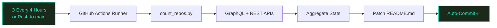
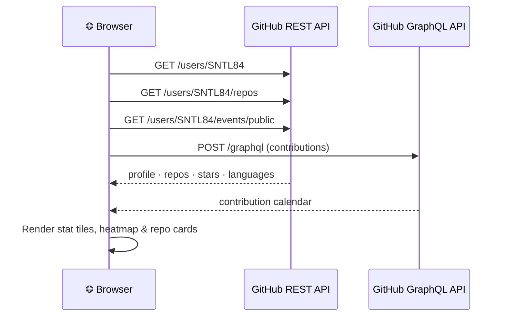

<!-- AUTO-GENERATED STATS UPDATE EVERY 4 HOURS - OPTIMIZED FOR GITHUB BADGES -->

<div align="center">


# 🔢 SNTL84 · Live Repository Counter

[](https://github.com/SNTL84/sntl84-repo-counter/actions)
[](https://github.com/SNTL84/sntl84-repo-counter/actions)
[](https://www.python.org)
[](LICENSE)
[](https://github.com/SNTL84)
[](https://desidevloper.com)
[](https://sntl84.github.io/sntl84-repo-counter/sntl84-Client-Dashboard.html)

---

### ⚡ *"I Automate What's Costing You Time."*
**Milan · SNTL 84 · AI Workflow Developer · Surat, India**

A self-updating, zero-maintenance repository dashboard that pulls live stats straight from the GitHub REST + GraphQL APIs — no manual edits, no stale numbers, ever.

</div>

---

## 📊 Live Repository Statistics

<!-- REPO_COUNT_START -->
| Metric | Count | Details |
|--------|-------|---------|
| 🌐 Public Repos  | **66** | All public repositories |
| 🔒 Private Repos | **0** | Requires `GH_PAT` secret (repo scope) for accuracy |
| 📦 Total Repos   | **66** | Public + Private |
| ⭐ Total Stars   | **63** | Across all public repos |
| 🍴 Total Forks   | **0** | Across all public repos |
| 🏆 Top Language  | **HTML** | 22 repos |
<!-- REPO_COUNT_END -->

<!-- TIMESTAMP_START -->
> 🕐 *Last updated: **09 Sep 2026 · 17:52 UTC** · Auto-refreshes every 4 hours via GitHub Actions*
<!-- TIMESTAMP_END -->

---

## 🏗️ How It Works — At a Glance


```mermaid
flowchart LR
    A[⏰ Every 4 Hours
or Push to main] --> B[GitHub Actions Runner]
    B --> C[count_repos.py]
    C --> D[GraphQL + REST APIs]
    D --> E[Aggregate Stats]
    E --> F[Patch README.md]
    F --> G[Auto-Commit ✅]
    style A fill:#1a2a1a,stroke:#22e0b8,color:#22e0b8
    style G fill:#1a2a1a,stroke:#22e0b8,color:#22e0b8
```

---

## 🚀 Quick Start

### For Visitors
1. **Live Stats** — see the [statistics table](#-live-repository-statistics) above
2. **Interactive Dashboard** — open the [Live Dashboard](https://sntl84.github.io/sntl84-repo-counter/sntl84-Client-Dashboard.html), powered by REST + GraphQL, rendered client-side
3. **Hire SNTL84** — [message on WhatsApp](https://wa.me/919727413309) for AI automation & full-stack builds

### For Contributors
```bash
# 1. Fork & clone
git clone https://github.com/YOUR-USERNAME/sntl84-repo-counter.git

# 2. Set up environment
python -m venv venv && source venv/bin/activate
pip install -r requirements.txt

# 3. Run locally
export GH_TOKEN=your_token
python scripts/count_repos.py

# 4. Submit a PR 🎉
```
See [CONTRIBUTING.md](CONTRIBUTING.md) for full guidelines.

---

## 🔑 Unlock Accurate Private Repo Counts

> **Private repos showing `0`?** The default `GITHUB_TOKEN` can't read private repo data — add a Personal Access Token to fix it.

| Step | Action |
|------|--------|
| 1️⃣ | **GitHub → Settings → Developer Settings → Personal Access Tokens → Classic** |
| 2️⃣ | Generate a token with **`repo`** scope |
| 3️⃣ | Go to **this repo → Settings → Secrets and Variables → Actions** |
| 4️⃣ | Create a secret named **`GH_PAT`** with your token value |
| 5️⃣ | Re-run the workflow — private counts will now be accurate ✅ |

---

## 🔄 Live Dashboard API Flow

> The [dashboard](https://sntl84.github.io/sntl84-repo-counter/sntl84-Client-Dashboard.html) calls GitHub's REST & GraphQL APIs **directly from the browser** — no backend, no cache, no proxy.


```mermaid
sequenceDiagram
    participant U as 🌐 Browser
    participant R as GitHub REST API
    participant G as GitHub GraphQL API
    U->>R: GET /users/SNTL84
    U->>R: GET /users/SNTL84/repos
    U->>R: GET /users/SNTL84/events/public
    U->>G: POST /graphql (contributions)
    R-->>U: profile · repos · stars · languages
    G-->>U: contribution calendar
    U->>U: Render stat tiles, heatmap & repo cards
```

---

## ⚙️ Engine Internals

| Setting | Value |
|---------|-------|
| 🔁 Schedule | Every 4 hours |
| 🔐 Auth | `GITHUB_TOKEN` (public) + `GH_PAT` (private) |
| 🤖 Bot | SNTL84-Bot |
| 📝 Commit | `chore: auto-update repo count [skip ci]` |
| ⚡ Retry Logic | 3 attempts, exponential backoff |
| 📊 Observability | Rate-limit aware, metrics tracked |

---

## 📖 Case Study — Solving the "Stale Stats" Problem

**The problem.** A GitHub profile with 60+ repositories is hard to summarize honestly. Manually editing a README every time a repo is created, starred, or archived doesn't scale — the numbers go stale within days, and stale numbers on a developer's profile quietly undercut their credibility with recruiters, clients, and collaborators.

**The approach.** Rather than build another static badge, this project treats the README itself as a build target. A scheduled GitHub Actions workflow runs `count_repos.py` every four hours (and on every push to `main`), which queries the GitHub REST and GraphQL APIs for public repo count, star count, fork count, and top language, then patches the numbers directly between HTML comment markers in `README.md` and commits the change back automatically.

**The tech stack.** Python 3.11+ for the counting script, GitHub Actions for scheduling and compute, the GitHub REST + GraphQL APIs for data, and a lightweight client-side dashboard (`sntl84-Client-Dashboard.html`) that calls the same APIs directly from the browser for a live, interactive view — no backend server, no database, no cache layer to maintain.

**The result.** Zero manual maintenance. The stats table, the timestamp, and the repository list all update themselves on a fixed cadence with retry logic and exponential backoff for reliability. For visitors, that means every number on this page is current as of the last four hours — not the last time someone remembered to edit a README.

**Why it matters beyond this repo.** The same pattern — treat documentation as a build artifact, not a hand-edited file — is the basis for the automation work SNTL84 builds for clients: WhatsApp-driven registration flows, auto-refreshing dashboards, and reporting pipelines that remove a human from the update loop entirely.

---

## ❓ FAQ — Purpose of This Repository

**Q: What does this repository actually do?**
A: It keeps a live, auto-updating count of SNTL84's public GitHub repositories — total repos, stars, forks, and top language — displayed right in this README, with no manual editing required.

**Q: How often do the stats refresh?**
A: Every 4 hours automatically via a scheduled GitHub Actions workflow, and immediately on any push to `main`.

**Q: Where do the numbers come from?**
A: Directly from the GitHub REST and GraphQL APIs — the same data GitHub itself uses, queried live by `count_repos.py`.

**Q: Is there a visual dashboard, or just this table?**
A: Both. The table above lives in this README, and a full interactive [Live Dashboard](https://sntl84.github.io/sntl84-repo-counter/sntl84-Client-Dashboard.html) renders stat tiles, a contribution heatmap, and repo cards client-side in the browser.

**Q: Why is the private repo count showing 0?**
A: The default `GITHUB_TOKEN` GitHub Actions provides can't read private repo data. Adding a personal access token as a `GH_PAT` secret (see the [Unlock Accurate Private Repo Counts](#-unlock-accurate-private-repo-counts) section) fixes this.

**Q: Can I reuse this for my own GitHub profile?**
A: Yes — fork the repo, follow the [Quick Start](#-quick-start) steps for contributors, point it at your own username, and the same workflow will maintain your own live stats table.

**Q: What's the tech stack?**
A: Python 3.11+ for the counting logic, GitHub Actions for scheduling, and the GitHub REST + GraphQL APIs for data — no external database or hosting required.

**Q: Who built this, and why?**
A: Milan (SNTL84), an AI workflow developer based in Surat, India, who builds automation that removes repetitive manual work — this repo is a small, public example of that same philosophy applied to his own GitHub profile.

**Q: How do I get in touch about custom automation work?**
A: [Message SNTL84 on WhatsApp](https://wa.me/919727413309) or visit [desidevloper.com](https://desidevloper.com).

---

## 📁 All Public Repositories

<!-- REPO_LIST_START -->
