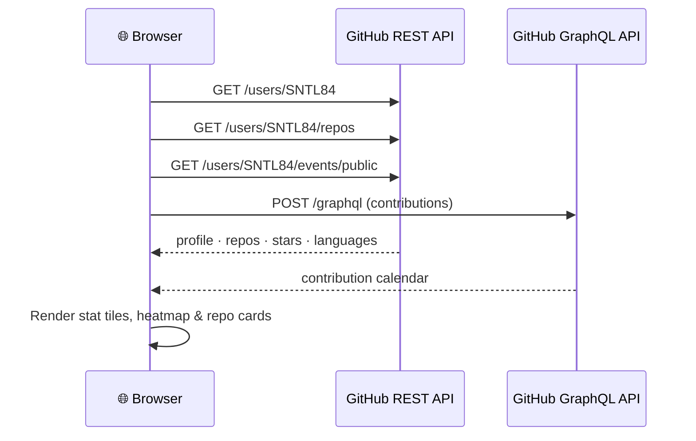

<!-- AUTO-GENERATED STATS UPDATE EVERY 4 HOURS - OPTIMIZED FOR GITHUB BADGES -->

<div align="center">


<!-- TYPING_START -->

<!-- TYPING_END -->

# 🔢 SNTL84 · Live Repository Counter

[](https://github.com/SNTL84/sntl84-repo-counter/actions)
[](https://github.com/SNTL84/sntl84-repo-counter/actions)
[](https://www.python.org)
[](LICENSE)
[](https://github.com/SNTL84)
[](https://desidevloper.com)
[](https://sntl84.github.io/sntl84-repo-counter/sntl84-Client-Dashboard.html)

---

### ⚡ *"I Automate What's Costing You Time."*
**Milan · SNTL 84 · AI Workflow Developer · Surat, India**

A self-updating, zero-maintenance repository dashboard that pulls live stats straight from the GitHub REST + GraphQL APIs — no manual edits, no stale numbers, ever.

</div>

---

## 📊 Live Repository Statistics

<!-- REPO_COUNT_START -->
| Metric | Count | Details |
|--------|-------|---------|
| 🌐 Public Repos  | **69** | All public repositories |
| 🔒 Private Repos | **0** | Requires `GH_PAT` secret (repo scope) for accuracy |
| 📦 Total Repos   | **69** | Public + Private |
| ⭐ Total Stars   | **66** | Across all public repos |
| 🍴 Total Forks   | **0** | Across all public repos |
| 🏆 Top Language  | **HTML** | 23 repos |
<!-- REPO_COUNT_END -->

<!-- TIMESTAMP_START -->
> 🕐 *Last updated: **07 Oct 2026 · 21:07 UTC** · Auto-refreshes every 4 hours via GitHub Actions*
<!-- TIMESTAMP_END -->

---

## 🏗️ How It Works — At a Glance


```mermaid
flowchart LR
    A["⏰ Every 4 Hours<br/>or Push to main"] --> B[GitHub Actions Runner]
    B --> C[count_repos.py]
    C --> D[GraphQL + REST APIs]
    D --> E[Aggregate Stats]
    E --> F[Patch README.md]
    F --> G[Auto-Commit ✅]
    style A fill:#1a2a1a,stroke:#22e0b8,color:#22e0b8
    style G fill:#1a2a1a,stroke:#22e0b8,color:#22e0b8
```

---

## 🚀 Quick Start

### For Visitors
1. **Live Stats** — see the [statistics table](#-live-repository-statistics) above
2. **Interactive Dashboard** — open the [Live Dashboard](https://sntl84.github.io/sntl84-repo-counter/sntl84-Client-Dashboard.html), powered by REST + GraphQL, rendered client-side
3. **Hire SNTL84** — [message on WhatsApp](https://wa.me/919727413309) for AI automation & full-stack builds

### For Contributors
```bash
# 1. Fork & clone
git clone https://github.com/YOUR-USERNAME/sntl84-repo-counter.git

# 2. Set up environment
python -m venv venv && source venv/bin/activate
pip install -r requirements.txt

# 3. Run locally
export GH_TOKEN=your_token
python scripts/count_repos.py

# 4. Submit a PR 🎉
```
See [CONTRIBUTING.md](CONTRIBUTING.md) for full guidelines.

---

## 🔑 Unlock Accurate Private Repo Counts

> **Private repos showing `0`?** The default `GITHUB_TOKEN` can't read private repo data — add a Personal Access Token to fix it.

| Step | Action |
|------|--------|
| 1️⃣ | **GitHub → Settings → Developer Settings → Personal Access Tokens → Classic** |
| 2️⃣ | Generate a token with **`repo`** scope |
| 3️⃣ | Go to **this repo → Settings → Secrets and Variables → Actions** |
| 4️⃣ | Create a secret named **`GH_PAT`** with your token value |
| 5️⃣ | Re-run the workflow — private counts will now be accurate ✅ |

---

## 🔄 Live Dashboard API Flow

> The [dashboard](https://sntl84.github.io/sntl84-repo-counter/sntl84-Client-Dashboard.html) calls GitHub's REST & GraphQL APIs **directly from the browser** — no backend, no cache, no proxy.


```mermaid
sequenceDiagram
    participant U as 🌐 Browser
    participant R as GitHub REST API
    participant G as GitHub GraphQL API
    U->>R: GET /users/SNTL84
    U->>R: GET /users/SNTL84/repos
    U->>R: GET /users/SNTL84/events/public
    U->>G: POST /graphql (contributions)
    R-->>U: profile · repos · stars · languages
    G-->>U: contribution calendar
    U->>U: Render stat tiles, heatmap & repo cards
```

---

## ⚙️ Engine Internals

| Setting | Value |
|---------|-------|
| 🔁 Schedule | Every 4 hours |
| 🔐 Auth | `GITHUB_TOKEN` (public) + `GH_PAT` (private) |
| 🤖 Bot | SNTL84-Bot |
| 📝 Commit | `chore: auto-update repo count [skip ci]` |
| ⚡ Retry Logic | 3 attempts, exponential backoff |
| 📊 Observability | Rate-limit aware, metrics tracked |

---

## 📖 Case Study — Solving the "Stale Stats" Problem

**The problem.** A GitHub profile with 60+ repositories is hard to summarize honestly. Manually editing a README every time a repo is created, starred, or archived doesn't scale — the numbers go stale within days, and stale numbers on a developer's profile quietly undercut their credibility with recruiters, clients, and collaborators.

**The approach.** Rather than build another static badge, this project treats the README itself as a build target. A scheduled GitHub Actions workflow runs `count_repos.py` every four hours (and on every push to `main`), which queries the GitHub REST and GraphQL APIs for public repo count, star count, fork count, and top language, then patches the numbers directly between HTML comment markers in `README.md` and commits the change back automatically.

**The tech stack.** Python 3.11+ for the counting script, GitHub Actions for scheduling and compute, the GitHub REST + GraphQL APIs for data, and a lightweight client-side dashboard (`sntl84-Client-Dashboard.html`) that calls the same APIs directly from the browser for a live, interactive view — no backend server, no database, no cache layer to maintain.

**The result.** Zero manual maintenance. The stats table, the timestamp, and the repository list all update themselves on a fixed cadence with retry logic and exponential backoff for reliability. For visitors, that means every number on this page is current as of the last four hours — not the last time someone remembered to edit a README.

**Why it matters beyond this repo.** The same pattern — treat documentation as a build artifact, not a hand-edited file — is the basis for the automation work SNTL84 builds for clients: WhatsApp-driven registration flows, auto-refreshing dashboards, and reporting pipelines that remove a human from the update loop entirely.

---

## ❓ FAQ — Purpose of This Repository

**Q: What does this repository actually do?**
A: It keeps a live, auto-updating count of SNTL84's public GitHub repositories — total repos, stars, forks, and top language — displayed right in this README, with no manual editing required.

**Q: How often do the stats refresh?**
A: Every 4 hours automatically via a scheduled GitHub Actions workflow, and immediately on any push to `main`.

**Q: Where do the numbers come from?**
A: Directly from the GitHub REST and GraphQL APIs — the same data GitHub itself uses, queried live by `count_repos.py`.

**Q: Is there a visual dashboard, or just this table?**
A: Both. The table above lives in this README, and a full interactive [Live Dashboard](https://sntl84.github.io/sntl84-repo-counter/sntl84-Client-Dashboard.html) renders stat tiles, a contribution heatmap, and repo cards client-side in the browser.

**Q: Why is the private repo count showing 0?**
A: The default `GITHUB_TOKEN` GitHub Actions provides can't read private repo data. Adding a personal access token as a `GH_PAT` secret (see the [Unlock Accurate Private Repo Counts](#-unlock-accurate-private-repo-counts) section) fixes this.

**Q: Can I reuse this for my own GitHub profile?**
A: Yes — fork the repo, follow the [Quick Start](#-quick-start) steps for contributors, point it at your own username, and the same workflow will maintain your own live stats table.

**Q: What's the tech stack?**
A: Python 3.11+ for the counting logic, GitHub Actions for scheduling, and the GitHub REST + GraphQL APIs for data — no external database or hosting required.

**Q: Who built this, and why?**
A: Milan (SNTL84), an AI workflow developer based in Surat, India, who builds automation that removes repetitive manual work — this repo is a small, public example of that same philosophy applied to his own GitHub profile.

**Q: How do I get in touch about custom automation work?**
A: [Message SNTL84 on WhatsApp](https://wa.me/919727413309) or visit [desidevloper.com](https://desidevloper.com).

---

## 📁 All Public Repositories

<!-- REPO_LIST_START -->
| # | Repository | Description | Language | ⭐ | 🍴 | Updated |
|---|------------|-------------|----------|----|----|---------|
| 1 | [SNTL84](https://github.com/SNTL84/SNTL84) | — | — | ⭐1 | — | 2026-10-07 |
| 2 | [sntl84-repo-counter](https://github.com/SNTL84/sntl84-repo-counter) | 🔢 Auto-updating repo counter for SNTL84 · Milan · desidevloper.com — live count of al | 🌐 HTML | ⭐1 | — | 2026-10-07 |
| 3 | [Velocity](https://github.com/SNTL84/Velocity) | 🚀🪐🌕🌑☄️🛸 Opensource equivalent of Google's Antigravity/Claude Code/Cursor | — | ⭐1 | — | 2026-10-04 |
| 4 | [Metromate-Website-Roadmap](https://github.com/SNTL84/Metromate-Website-Roadmap) | 🚀 Complete Website Development Roadmap for Tragad Soni ｜ AI-Powered Automation ｜ Supp | 🌐 HTML | ⭐1 | — | 2026-10-04 |
| 5 | [sntl84-desidevloper-live-demo](https://github.com/SNTL84/sntl84-desidevloper-live-demo) | 🚀 Live Demo — Services by desidevloper.com ｜ AI Systems · Full-Stack Builds · Supply  | 🌐 HTML | ⭐1 | — | 2026-10-04 |
| 6 | [RamdevCab](https://github.com/SNTL84/RamdevCab) | 🚖 Ramdev Cab Taxi Service, Surat: digital launch kit by SNTL 84 ｜ Automate What's Cos | 🐚 Shell | ⭐1 | — | 2026-10-02 |
| 7 | [radhey-jewels-metromate-business-setup](https://github.com/SNTL84/radhey-jewels-metromate-business-setup) | 🌟 Case Study: Radhey Jewels (Imitation Jewellery) — Complete WhatsApp, Instagram & Fa | — | ⭐1 | — | 2026-09-23 |
| 8 | [earth-elements-business-setup](https://github.com/SNTL84/earth-elements-business-setup) | Case Study: Earth Elements (Numerology • Crystal • Gemstone) — Google Business Profil | — | ⭐1 | — | 2026-09-22 |
| 9 | [mads-metro-ad-services](https://github.com/SNTL84/mads-metro-ad-services) | MADS (Metro Ad Services) — cycle advertising business plan, operations dashboard, and | 🌐 HTML | ⭐1 | — | 2026-09-22 |
| 10 | [metromate-shiv-kathiawadi-thali-brand-development](https://github.com/SNTL84/metromate-shiv-kathiawadi-thali-brand-development) | 🍛 Complete Brand Development Case Study — MetroMate Real Marketing × Shiv Kathiawadi  | 🌐 HTML | ⭐1 | — | 2026-09-09 |
| 11 | [SNTL84-Growth-Engine](https://github.com/SNTL84/SNTL84-Growth-Engine) | 🚀 SNTL 84 — Your Growth Engine ｜ Lead Gen • AI Automation • Fulfillment • Bench Resou | — | ⭐3 | — | 2026-08-29 |
| 12 | [wacrm](https://github.com/SNTL84/wacrm) | Self-hostable CRM template for WhatsApp — shared inbox, contacts, sales pipelines, br | — | — | — | 2026-08-28 |
| 13 | [metromate-performance-marketing](https://github.com/SNTL84/metromate-performance-marketing) | MetroMate Performance Marketing — social media account cleanup, fulfillment automatio | — | ⭐1 | — | 2026-08-16 |
| 14 | [metromate-mahadev-restaurant-pal-surat-case-study](https://github.com/SNTL84/metromate-mahadev-restaurant-pal-surat-case-study) | MetroMate Performance Marketing — Full-scale launch of Mahadev Restaurant's new branc | 🌐 HTML | ⭐1 | — | 2026-07-28 |
| 15 | [Indian-Food-Image-Dataset](https://github.com/SNTL84/Indian-Food-Image-Dataset) | 🍛 Open dataset of Indian food images for AI/ML — built for classification, detection  | — | ⭐1 | — | 2026-07-27 |
| 16 | [api-cookbook](https://github.com/SNTL84/api-cookbook) | A collection of projects and guides with Perplexity's API Platform | — | — | — | 2026-07-26 |
| 17 | [whatsapp-outreach-tool](https://github.com/SNTL84/whatsapp-outreach-tool) | ⚡ Zero-install WhatsApp Outreach Tool — Bulk contact management, custom messages, VCF | 🌐 HTML | ⭐1 | — | 2026-07-24 |
| 18 | [ts-type-mastery](https://github.com/SNTL84/ts-type-mastery) | 🔥 TypeScript Type Challenges — Elite solutions, annotated mental models & reusable ty | 🔷 TS | ⭐1 | — | 2026-07-24 |
| 19 | [sntl84-fmcg-lead-intel](https://github.com/SNTL84/sntl84-fmcg-lead-intel) | 🧠 FMCG Lead Intelligence Engine — n8n + Claude AI. Automates distributor outreach: sc | — | ⭐1 | — | 2026-07-24 |
| 20 | [sntl84-multilingual-statement-generator](https://github.com/SNTL84/sntl84-multilingual-statement-generator) | Client Conversion Statements Multilingual Generator — 29 statements · 39 languages ·  | 🌐 HTML | ⭐1 | — | 2026-07-24 |
| 21 | [sntl84-backoffice-os](https://github.com/SNTL84/sntl84-backoffice-os) | 🏢 BACKOFFICE OS v2.0 — A small utility HR back-office dashboard. Attendance, payroll, | 🌐 HTML | ⭐2 | — | 2026-07-24 |
| 22 | [sntl84-ai-hiring-intel](https://github.com/SNTL84/sntl84-ai-hiring-intel) | AI Hiring Intelligence System — Strict, business-focused resume evaluator. Built by M | 🌐 HTML | ⭐1 | — | 2026-07-24 |
| 23 | [sntl84-cohost-virtual-assistant-v3](https://github.com/SNTL84/sntl84-cohost-virtual-assistant-v3) | SNTL 84 Co-Host Virtual Assistant V3 — Premium AI-powered property management landing | 🌐 HTML | ⭐2 | — | 2026-07-14 |
| 24 | [open-issue-triage](https://github.com/SNTL84/open-issue-triage) | 🔧 Open Source Issue Triage — Maintainer-style responses to GitHub issues across the e | — | ⭐1 | — | 2026-07-03 |
| 25 | [react](https://github.com/SNTL84/react) | The library for web and native user interfaces. | — | — | — | 2026-06-30 |
| 26 | [undici](https://github.com/SNTL84/undici) | An HTTP/1.1 client, written from scratch for Node.js | — | — | — | 2026-06-30 |
| 27 | [sntl84-ecom-ad-campaigns](https://github.com/SNTL84/sntl84-ecom-ad-campaigns) | 📣 Service 08 — Ad Campaign Management ｜ Google · Meta · Instagram · Performance Marke | — | ⭐1 | — | 2026-06-29 |
| 28 | [sntl84-megait-stores-client](https://github.com/SNTL84/sntl84-megait-stores-client) | 🖥️ MEGA IT STORES — Full Client Digital Package ｜ Product Catalog + Performance Marke | 🌐 HTML | ⭐1 | — | 2026-06-29 |
| 29 | [sntl84-desidevloper](https://github.com/SNTL84/sntl84-desidevloper) | We learn everyday to think with our tools. ｜ AI Workflow Developer · Automation-Drive | — | ⭐1 | — | 2026-06-27 |
| 30 | [ruflo](https://github.com/SNTL84/ruflo) | 🌊 The leading agent meta-harness for Claude. Deploy intelligent multi-agent swarms, c | — | ⭐1 | — | 2026-06-27 |
| 31 | [cal.diy](https://github.com/SNTL84/cal.diy) | Scheduling infrastructure for absolutely everyone. | — | ⭐1 | — | 2026-06-27 |
| 32 | [sntl84-desi-quote](https://github.com/SNTL84/sntl84-desi-quote) | ⚡ DesiQuote — Instant Gig Quote Calculator by Milan · SNTL 84 · desidevloper.com ｜ AI | 🌐 HTML | ⭐1 | — | 2026-06-10 |
| 33 | [SNTL84BULKautomation-blaster-tools](https://github.com/SNTL84/SNTL84BULKautomation-blaster-tools) | WhatsApp & Aratt.ai Bulk Outreach Automation Tools by SNTL84 ｜ AI Workflow Profession | 🌐 HTML | ⭐1 | — | 2026-06-10 |
| 34 | [SNTL84-Resume](https://github.com/SNTL84/SNTL84-Resume) | I Automate What's Costing You Money. · Milan · SNTL 84 · AI Workflow Professional · S | — | ⭐1 | — | 2026-06-10 |
| 35 | [sntl84-python-foundations-projects](https://github.com/SNTL84/sntl84-python-foundations-projects) | 🐍 Python Foundations — CLI Projects by Milan · SNTL 84 ｜ I Automate What's Costing Yo | 🐍 Python | ⭐1 | — | 2026-06-10 |
| 36 | [coral-heights-vehicle-registration](https://github.com/SNTL84/coral-heights-vehicle-registration) | Smart WhatsApp-based vehicle registration form for Coral Heights Society A-Wing. Buil | 🌐 HTML | ⭐1 | — | 2026-06-10 |
| 37 | [ai-lead-enrichment-agent](https://github.com/SNTL84/ai-lead-enrichment-agent) | 🚀 AI Lead Enrichment Agent – Enrich startup leads with founder names, funding stages, | 🌐 HTML | ⭐1 | — | 2026-06-10 |
| 38 | [n8n-india-smb-workflow-templates](https://github.com/SNTL84/n8n-india-smb-workflow-templates) | 🤖 Ready-to-import n8n workflow templates for Indian SMBs — WhatsApp leads, GST invoic | — | — | — | 2026-06-10 |
| 39 | [sntl84-next-saas-stripe-starter](https://github.com/SNTL84/sntl84-next-saas-stripe-starter) | SaaS Starter with User Roles & Admin Panel — Private fork by SNTL 84 · Milan · Automa | 🔷 TS | ⭐1 | — | 2026-06-10 |
| 40 | [automate-what-costs-you](https://github.com/SNTL84/automate-what-costs-you) | 🚀 AI Automation Toolkit by Milan · SNTL 84 — Workflows, Bots & Business Intelligence  | 🌐 HTML | ⭐1 | — | 2026-06-10 |
| 41 | [sntl84-ecom-seo-optimization](https://github.com/SNTL84/sntl84-ecom-seo-optimization) | 🔎 Service 07 — eCommerce SEO Optimization ｜ Google Rank · On-Page · Technical SEO ｜ S | — | ⭐1 | — | 2026-06-10 |
| 42 | [desidevloper](https://github.com/SNTL84/desidevloper) | DesiDeveloper - Full-stack React portfolio & trade directory platform with Vite, Reac | — | — | — | 2026-06-10 |
| 43 | [desidevloper-portfolio-nextjs](https://github.com/SNTL84/desidevloper-portfolio-nextjs) | 🚀 desidevloper.com — Next.js 14 + TypeScript + TailwindCSS + Framer Motion portfolio. | 🔷 TS | — | — | 2026-06-10 |
| 44 | [MetroMate](https://github.com/SNTL84/MetroMate) | 🏢 ResidentialParkingManagementServices ｜ Automate What's Costing You Money ｜ SNTL 84  | 🌐 HTML | ⭐1 | — | 2026-06-10 |
| 45 | [sntl84-hiring-system](https://github.com/SNTL84/sntl84-hiring-system) | AI-Powered Hiring System — Smart Job Board & Candidate Portal by SNTL 84 ｜ Vercel-Rea | — | ⭐1 | — | 2026-06-08 |
| 46 | [sntl84-superpowers](https://github.com/SNTL84/sntl84-superpowers) | An agentic skills framework & software development methodology that works. | 🐚 Shell | ⭐1 | — | 2026-06-08 |
| 47 | [ai-studio-99page-generator](https://github.com/SNTL84/ai-studio-99page-generator) | 99 Page in 3 prompts | 🔷 TS | ⭐1 | — | 2026-06-08 |
| 48 | [sntl84-desidevloper-services-page](https://github.com/SNTL84/sntl84-desidevloper-services-page) | Desi devloper Services page  | — | ⭐1 | — | 2026-06-08 |
| 49 | [sntl84-linkedin-activity-archive](https://github.com/SNTL84/sntl84-linkedin-activity-archive) | Complete LinkedIn activity archive for SNTL2784 - Posts, reposts, media links, analyt | — | ⭐1 | — | 2026-06-08 |
| 50 | [sntl84-real-estate-claude-agent](https://github.com/SNTL84/sntl84-real-estate-claude-agent) | AI-powered property valuation & investment analysis for Surat, Gujarat — SNTL84 Frame | 🔷 TS | ⭐1 | — | 2026-06-08 |
| 51 | [sntl84-enterprise-ai-services](https://github.com/SNTL84/sntl84-enterprise-ai-services) | 🚀 Enterprise AI Automation & Workflow Solutions — Premium services in AI workflow dev | — | ⭐1 | — | 2026-06-08 |
| 52 | [sntl84-shopify-leadgen-proposal](https://github.com/SNTL84/sntl84-shopify-leadgen-proposal) | Automate What's Costing You Money — Shopify AI Automation & Growth Systems for D2C Br | 🌐 HTML | ⭐1 | — | 2026-06-08 |
| 53 | [sntl84-agentic-recruiter](https://github.com/SNTL84/sntl84-agentic-recruiter) | 🤖 AI-Powered Recruitment Screening Module ｜ Automate What's Costing You Money ｜ Reduc | 🌐 HTML | ⭐2 | — | 2026-05-31 |
| 54 | [awesome-ai-sales-agents](https://github.com/SNTL84/awesome-ai-sales-agents) | A curated Awesome list of AI SDR and autonomous sales agent tools — for founders, sal | — | ⭐1 | — | 2026-05-21 |
| 55 | [ai-frontend-projects](https://github.com/SNTL84/ai-frontend-projects) | 45 battle-tested AI frontend builds · real revenue targets · ship-ready code · OpenAI | 🌐 HTML | ⭐1 | — | 2026-05-03 |
| 56 | [sntl84-business-intelligence-push](https://github.com/SNTL84/sntl84-business-intelligence-push) | 🧠 Service Master with Deep BI — 264 Services · 22 Industry Categories · Full B2B Trad | — | ⭐1 | — | 2026-05-02 |
| 57 | [sntl84-shiv-gujarati-thali](https://github.com/SNTL84/sntl84-shiv-gujarati-thali) | 🍽️ Full-stack digital presence for Shiv Gujarati Unlimited Thali, Surat — Landing pag | 🐚 Shell | ⭐1 | — | 2026-05-02 |
| 58 | [sntl84-dev-profile](https://github.com/SNTL84/sntl84-dev-profile) | Automate What's Costing You Money. SNTL 84 Developer Profile + Python Journey Tracker | 🌐 HTML | ⭐1 | — | 2026-05-02 |
| 59 | [sntl84-service-catalog-v1](https://github.com/SNTL84/sntl84-service-catalog-v1) | 🗂️ Service Catalog V1 — 48 AI & Digital Services by SNTL84 ｜ AI Workflow · Web Dev ·  | 🌐 HTML | ⭐1 | — | 2026-05-02 |
| 60 | [sntl84-ecom-store-setup](https://github.com/SNTL84/sntl84-ecom-store-setup) | 🛒 Service 01 — Full eCommerce Store Setup ｜ Shopify · WooCommerce · Custom Stack ｜ SN | — | ⭐1 | — | 2026-05-02 |
| 61 | [sntl84-ecom-dropshipping-setup](https://github.com/SNTL84/sntl84-ecom-dropshipping-setup) | 📦 Service 02 — Dropshipping Setup ｜ Supplier Sourcing · Store Automation · ₹0 Invento | — | ⭐1 | — | 2026-05-02 |
| 62 | [sntl84-ecom-marketplace-listing](https://github.com/SNTL84/sntl84-ecom-marketplace-listing) | 🏪 Service 03 — Marketplace Listing Management ｜ Amazon · Flipkart · Meesho · A+ Conte | — | ⭐1 | — | 2026-05-02 |
| 63 | [sntl84-ecom-product-sourcing](https://github.com/SNTL84/sntl84-ecom-product-sourcing) | 🔍 Service 04 — Product Sourcing ｜ Supplier Vetting · Margin Protection · India & Asia | — | ⭐1 | — | 2026-05-02 |
| 64 | [sntl84-ecom-order-fulfillment](https://github.com/SNTL84/sntl84-ecom-order-fulfillment) | 🚚 Service 05 — Order Fulfillment Automation ｜ Shiprocket · Delhivery · End-to-End Ops | — | ⭐1 | — | 2026-05-02 |
| 65 | [sntl84-ecom-payment-integration](https://github.com/SNTL84/sntl84-ecom-payment-integration) | 💳 Service 06 — Payment Integration ｜ Razorpay · Paytm · UPI · Stripe · COD ｜ SNTL84 D | — | ⭐1 | — | 2026-05-02 |
| 66 | [sntl84-ecom-inventory-sync](https://github.com/SNTL84/sntl84-ecom-inventory-sync) | 🔄 Service 09 — Inventory Sync & Management ｜ Real-Time Stock · Multi-Channel · EasyEc | — | ⭐1 | — | 2026-05-02 |
| 67 | [sntl84-ecom-customer-support](https://github.com/SNTL84/sntl84-ecom-customer-support) | 🎧 Service 11 — Customer Support Setup ｜ WhatsApp · Chatbot · Helpdesk · CRM ｜ SNTL84  | — | — | — | 2026-05-02 |
| 68 | [sntl84-ecom-returns-mgmt](https://github.com/SNTL84/sntl84-ecom-returns-mgmt) | ↩️ Service 10 — Returns & RTO Management ｜ Automated Returns · Refunds · RTO Recovery | — | ⭐1 | — | 2026-05-02 |
| 69 | [shopify-leadgen-proposal](https://github.com/SNTL84/shopify-leadgen-proposal) | Premium Shopify Development & AI Automation — Lead Generation Proposal by desidevlope | — | ⭐1 | — | 2026-04-29 |
| — | *Private repos* | *0 detected — add GH_PAT secret (repo scope) if you have private repos* | 🔒 Private | — | — | — |
<!-- REPO_LIST_END -->
